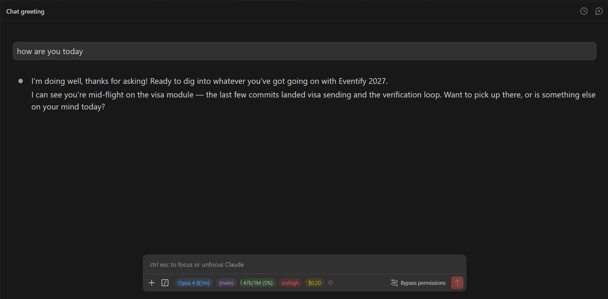

# Claude Panel Status

[](https://open-vsx.org/extension/louxiaxiaohei/claude-panel-status)
[](https://open-vsx.org/extension/louxiaxiaohei/claude-panel-status)
[](LICENSE)

> **Unofficial community extension** — not affiliated with or endorsed by Anthropic. It locally
> patches the installed Claude Code extension's webview (a backup is kept; see caveats below).

Adds an always-visible, colored panel status indicator to the **Claude Code** panel's input toolbar (next to the
`/` button):



```
[Fable 5] [(main)] [487k/1M (49%)] [e:xhigh] [think] [$12.35] ⚙
```

- **Model** actually running (blue)
- **Git branch**, live — updates within seconds of a checkout (purple)
- **Context usage** as `used/window (%)` — the pill fills like a progress bar and turns
  green → yellow (≥50%) → red (≥80%)
- **Reasoning effort**, colored by level
- **think** indicator when extended thinking is on (orange)
- **Session cost** when the API reports one (yellow)
- **⚙ gear menu**: show/hide any item + zoom the conversation transcript only (80%–160%) —
  the panel header and input box stay at normal size. Preferences persist.

## Why this exists

Claude Code's `statusLine` setting only works in the terminal TUI — the VSCode panel never runs it,
and the panel's built-in context indicator stays hidden until less than 50% of context remains.
This extension patches the Claude Code extension's webview bundle to add the panel status indicator, and re-applies
the patch automatically after every Claude extension auto-update (checks at startup and every 60s,
then offers a one-click window reload).

## Install

**Marketplace: [Open VSX Registry](https://open-vsx.org/extension/louxiaxiaohei/claude-panel-status)**

### VSCodium, Cursor, Windsurf, Gitpod, Eclipse Theia

These editors read Open VSX directly. Extensions view → search **Claude Panel Status** → Install.

### Stock VS Code

Stock VS Code reads Microsoft's marketplace, where this extension is not published. Grab the `.vsix`
from Open VSX and install it manually:

```
curl -LO https://open-vsx.org/api/louxiaxiaohei/claude-panel-status/2.0.0/file/louxiaxiaohei.claude-panel-status-2.0.0.vsix
code --install-extension louxiaxiaohei.claude-panel-status-2.0.0.vsix
```

Or: Extensions view → `⋯` → **Install from VSIX…** and pick the downloaded file.

Restart VSCode once. When the notification appears, click **Reload Window**.

## Notes / caveats

- This modifies the installed Claude Code extension's `webview/index.js` **locally** (a backup is kept
  as `index.js.cp-status.bak` next to it). Unofficial — use at your own risk.
- If a future Claude version restructures its bundle, you'll get a warning ("patch anchor not found")
  instead of a broken panel; the patch logic then needs an update.
- Power users: drop an edited copy of the patcher at `~/.claude/patch-claude-vscode-panel.js` — it
  takes precedence over the bundled one, so you can customize the panel status without reinstalling.
- To uninstall cleanly: uninstall this extension, then restore the `.cp-status.bak` backup (or simply
  reinstall/update the Claude Code extension).

## Author

**Howard Stark** — [GitHub](https://github.com/LouXiaXiaoHei)

Issues and PRs welcome.

> **Forked from** [omarkara/claude-status-chip](https://github.com/omarkara/claude-status-chip) — original MIT-licensed project by Omar Kara.

## License

MIT — see [LICENSE](LICENSE).
